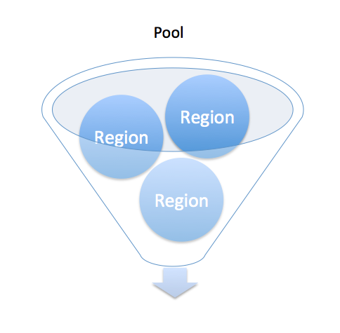

# Getting Started: Basic Concepts

## Pools
A `pool` is the highest level concept to understand in SerialBox.  A pool 
defines a border around which groups of *numbers* can be organized.  For example,
if you think of a pool of voters where each voter is an independent entity
but, at the same time, falls within the group due to a party affiliation you 
are on the right track.  

A pool contains various `region`s of numbers that are independent entities, much like the voters
in the example above, but are (through affiliation in the database) linked
to a pool.  This affiliation allows the API to group requests of numbers from
specific pools in such a way that those requests can be serviced by many 
independent `region` entities.  

## Regions
As the name might suggest, a `region` is a stateful component that has a specific *begginning*
and *ending*.  I use those terms because unlike, for example, sequential 
number ranges that have a start value and an end value, you may have a random
region that has different types of stateful values relative to it's size, current number, etc.

Regions are what, ultimately, serve up discrete responses from the SerialBox API. 
Each `region`, as it becomes depleted, enters and inactive state and the next 
`region` that is available in a given pool can start servicing requests for numbers.
Depleted `region`s are marked as inactive and the next `region` available is determined
by each `region`'s `order` property.

## Generators
Generators are tightly coupled to regions.  Each defined type of region (sequential,
random, word, etc.) must have a generator that knows how to respond to requests
for numbers from the pool it is coupled with.  Much like each restaurant must 
have waiters to service the customers, each *type* of region must have a 
generator to service API requests.  Out-of-the-box, SerialBox only comes 
with a single Generator to handle Sequential number requests from the 
`SequentialRegion` class defined within the framework; however, when SerialBox
is extended via `FlavorPackApp`s, new `Generator` classes must be defined and
paired with any new types of `region`s.

## Number Allocation
*Number Allocation* is a term used throughout the documentation to describe
the process by which *numbers* are received by request through the SerialBox
API.  The request for numbers, any logging that takes place and the response 
received from the allocation API all fall within the 
*number allocation* process.  

## FlavorPacks
*FlavorPacks* allow developers to extend and compliment the SerialBox 
framework by enabling custom `Region`s, and `Generator`s...as you will see
in this documentation's [Custom FlavorPacks](flavorpacks/) documentation 
example.

